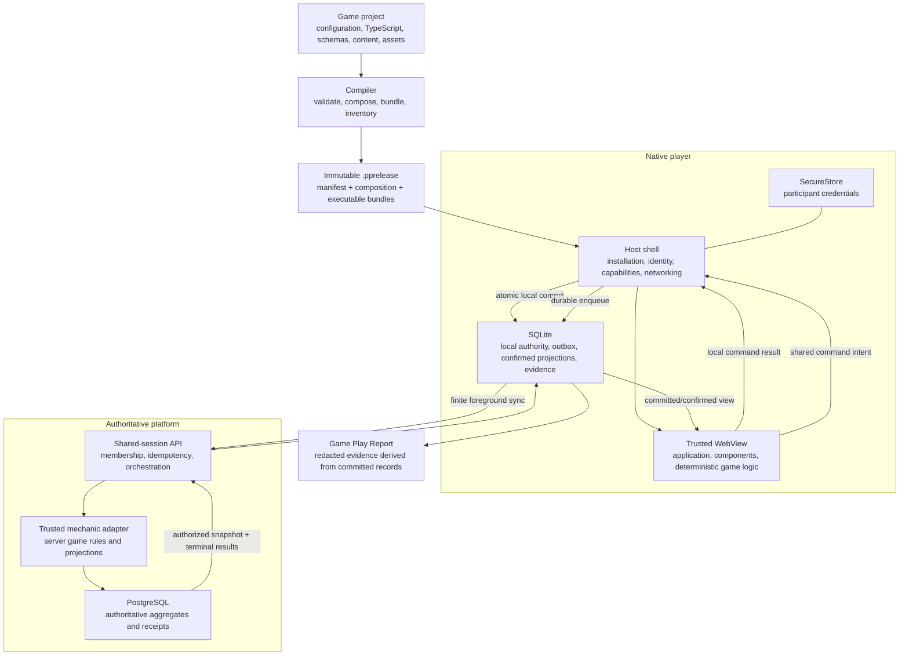
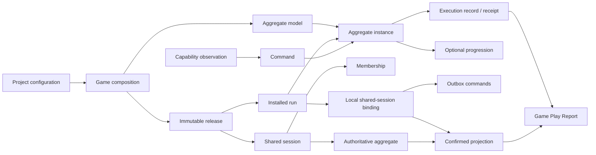
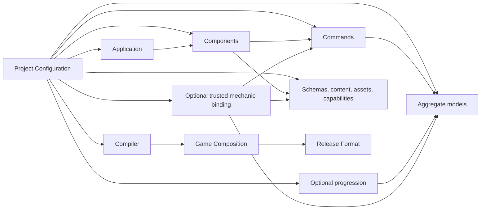
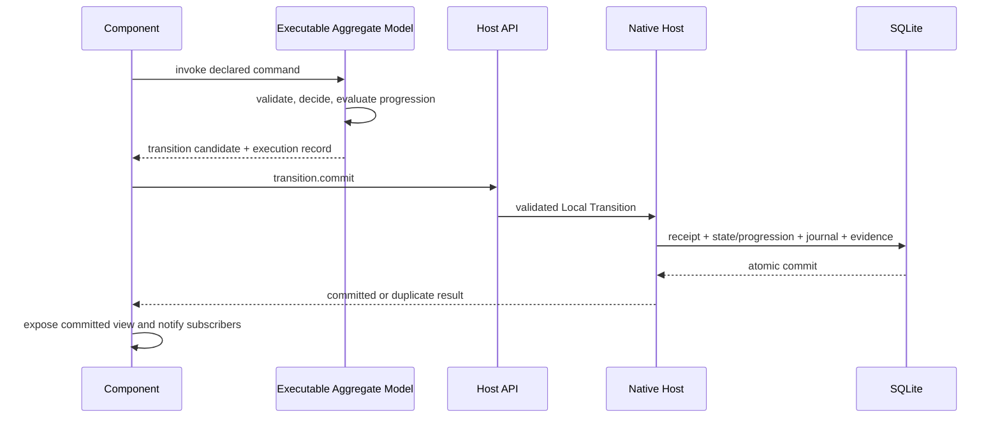
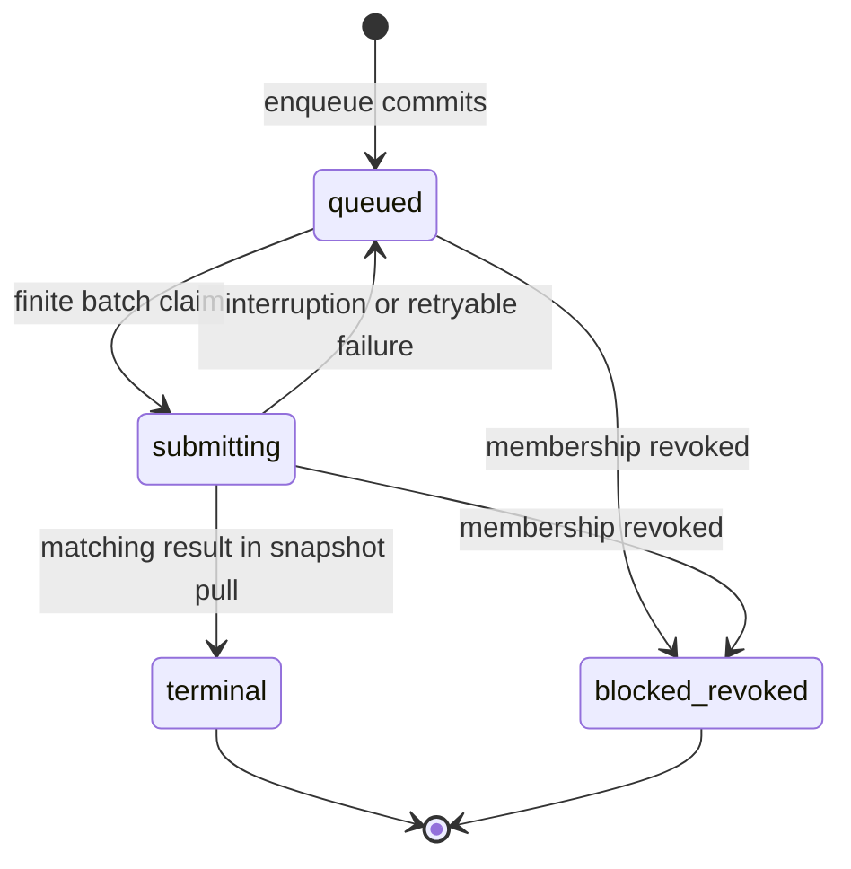

# Plotpoint Architecture

Plotpoint is a programmable runtime for location-aware games, interactive stories, puzzle hunts,
tours, and other real-world experiences. A game owns its rules, content, progression, and
presentation. Plotpoint provides the stable machinery for compiling that game, running it on a device,
committing durable state, invoking native capabilities, and coordinating authoritative shared play.

This document explains how those parts fit together. Exact serialized fields live in the linked
contracts; architectural decisions and their rationale live in the ADRs.

## System Overview



The important split is authority:

- Game logic computes deterministic decisions.
- The native host owns local durability, native capabilities, credentials, and network transport.
- The authoritative service owns shared membership and shared aggregate state.
- UI code presents committed views and submits intent; it does not mutate durable state directly.

## Architectural Patterns

| Pattern                                | How Plotpoint uses it                                                                                   | Why                                                                                |
| -------------------------------------- | ------------------------------------------------------------------------------------------------------- | ---------------------------------------------------------------------------------- |
| Functional core, imperative shell      | Command handlers and progression are pure; the player and API perform I/O                               | Decisions are deterministic, testable, and replayable                              |
| Hexagonal ports and adapters           | Host capabilities, local persistence, HTTP transport, and trusted mechanics sit behind narrow contracts | Game rules stay independent of devices, databases, and transport                   |
| Aggregate roots                        | Each command targets one `player`, `team`, or `session` aggregate                                       | One clear consistency and concurrency boundary per decision                        |
| CQRS-lite                              | Commands enter; committed local views or authorized shared projections leave                            | Write authority and presentation models remain distinct without a full CQRS system |
| Content-addressed immutable artifacts  | A release ID is derived from exact `.pprelease` bytes                                                   | Installed and session-pinned games are reproducible and inspectable                |
| Build-time composition                 | The compiler resolves models, commands, progression, components, resources, and capabilities            | The player needs no package discovery or mutable plugin registry                   |
| Schema-narrowed type erasure           | Typed models enter heterogeneous registries only through validating wrappers                            | Runtime flexibility does not discard type or schema authority                      |
| Durable outbox and idempotent receipts | Shared intent is persisted before submission; stable command IDs make retry exact                       | Disconnects and response loss do not duplicate accepted work                       |
| Complete snapshot recovery             | Shared pulls replace the complete authorized view atomically                                            | Recovery and authorization stay simpler than a delta engine                        |
| Keyed single-flight                    | One coordinator serializes foreground synchronization per shared session                                | Overlapping triggers coalesce without creating concurrent writers                  |
| Scoped capabilities                    | Components receive only declared commands, resources, projections, and native clients                   | Dependencies are explicit and cleanup remains host-owned                           |

Plotpoint deliberately does not use full event sourcing, a general dependency-injection container,
runtime plugins, microservices, or generic conflict merging. Those patterns add machinery without
improving the game loops the platform is designed to support.

Contract names and semantic IDs do not carry generation suffixes. TypeScript symbols, schema IDs,
command IDs, filenames, and catalog paths describe what they mean. Numeric compatibility metadata is
reserved for serialized boundaries and owned centrally by
[`CONTRACT_VERSIONS`](../packages/protocol/src/contract-versions.ts); `stateVersion` remains an
aggregate concurrency counter rather than a contract generation.

## Core Data Models

The main models form one chain from authored intent to durable play:



| Model                         | Purpose                                                                                                                          |
| ----------------------------- | -------------------------------------------------------------------------------------------------------------------------------- |
| Project configuration         | The sole authored description of application, models, commands, progression, components, resources, and trusted mechanic binding |
| Game composition              | The compiler-generated, data-only catalog the player and API can inspect                                                         |
| Immutable release             | Exact inventoried bytes identified by a content digest                                                                           |
| Run                           | A native installation/execution identity pinned to one release                                                                   |
| Aggregate model               | Schemas, initializer, commands, events, effects, and optional progression for one state boundary                                 |
| Aggregate instance            | One `player`, `team`, or `session` state value with an explicit concurrency counter                                              |
| Command and decision          | Intent plus the deterministic accepted, no-op, rejected, or invalid result                                                       |
| Execution record or receipt   | Canonical evidence of validation, decision, state versions, observations, and emitted facts                                      |
| Progression                   | Optional node-status state and deterministic transition rules owned by an aggregate model                                        |
| Observation                   | Structured evidence captured by a native capability and explicitly named by a command                                            |
| Shared session and membership | Release-pinned authority and the participants allowed to act within it                                                           |
| Shared binding and outbox     | The device's immutable session identity plus commands durably awaiting authoritative reconciliation                              |
| Projection and snapshot       | The complete participant-authorized shared view and terminal results                                                             |
| Game Play Report              | Redacted evidence derived from committed local and shared records                                                                |

Identity and schema travel with durable data. A human-readable ID selects a model or command;
`schemaId`, `schemaVersion`, and the digest of the exact schema bytes authorize its shape;
`stateVersion` is the sole aggregate concurrency and commit counter.

## Game Composition

A game is authored as a strict data-only project plus referenced TypeScript and data files. There is no
single executable `defineGame()` object and no runtime service locator.



Relationships have one owner:

- The application selects components.
- A component selects the commands, content, assets, capabilities, and optional shared projection it
  may use.
- A command points to its aggregate model.
- A progression points to its aggregate model.
- A trusted mechanic binding selects one server model, its commands, configuration, projection schema,
  and capabilities.

Reverse relationships are derived by the compiler. Models do not repeat command or progression lists,
and commands do not repeat trusted-mechanic identity.

### Project Configuration

`plotpoint.project.json` is the sole authored composition input. It declares:

- one game application;
- one local `player` aggregate model;
- optional server `team` or `session` models;
- local and trusted commands;
- optional local progression;
- components and their exact dependencies;
- schemas, content, assets, and native capabilities; and
- zero or one platform trusted-mechanic binding.

The configuration is strict JSON: no executable configuration, implicit discovery, globs, duplicate
keys, or unknown fields. Paths must remain inside the frozen project root. Every reference and selected
source export must resolve before bundling.

A small composition might look conceptually like this:

```json
{
  "application": {
    "definition": "src/application.ts#gameApplication",
    "components": ["play-screen"]
  },
  "aggregateModels": [
    { "id": "player", "authority": "local", "kind": "player" },
    { "id": "team", "authority": "server", "kind": "team" }
  ],
  "commands": [
    { "id": "game.local-action", "aggregateModel": "player", "execution": "local" },
    { "id": "game.shared-action", "aggregateModel": "team", "execution": "trusted-mechanic" }
  ],
  "components": [
    {
      "id": "play-screen",
      "commands": ["game.local-action", "game.shared-action"],
      "capabilities": ["plotpoint.location.foreground@1"]
    }
  ],
  "trustedMechanic": {
    "id": "plotpoint.example-mechanic",
    "aggregateModel": "team",
    "commands": ["game.shared-action"]
  }
}
```

The exact shape is defined by the
[Project Configuration and Game Composition contract](features/0005-unified-game-composition/contracts/game-composition.md).

### Compiler and Game Composition

The compiler:

1. captures the project files as an immutable build input;
2. validates configuration, references, paths, schemas, and capability agreement;
3. resolves closed logic and presentation import graphs;
4. inspects model, command, progression, application, and component definitions;
5. generates fixed application, component, and aggregate-model registries;
6. emits a canonical `composition/game.json` catalog; and
7. assembles the catalog, bundles, schemas, content, and assets into a release.

Game Composition is the runtime-readable lowering of Project Configuration. It contains only
canonical data: application and component descriptors, aggregate and command contracts, progression,
resource bindings, and an optional trusted-mechanic binding. It does not contain server executable
code.

## Immutable Releases

A `.pprelease` is the boundary between authoring and play. Its Release Format manifest records:

- release-format and Host API compatibility;
- exact paths, byte lengths, and digests for every entry;
- aggregate schemas and declared capabilities; and
- the fixed executable and composition entrypoints.

Release creation uses ordinal ordering and canonical JSON, packages a complete inventory, and derives
the release ID from the emitted artifact bytes. Verification checks structure, inventory, digests,
compatibility, and identity without executing game code.

The native player installs only a verified artifact. A run and an authoritative shared session are
pinned to one immutable release; publishing another release does not silently alter them. See
[ADR 0002](adrs/0002-immutable-release-format.md).

## Aggregate Runtime

### Aggregate Models

An aggregate model binds everything needed to initialize and execute one kind of game state:

```text
Aggregate Model
├── model identity and authority
├── aggregate kind: player | team | session
├── state and initialization schemas
├── deterministic initializer
├── command bindings keyed by command type
├── event and effect schemas
└── optional progression
```

An aggregate instance contains:

| Field                        | Meaning                                        |
| ---------------------------- | ---------------------------------------------- |
| `aggregateId`                | Identity of this player/team/session aggregate |
| `modelId`                    | Model that validates and executes it           |
| `aggregateKind`              | `player`, `team`, or `session`                 |
| `schemaId` / `schemaVersion` | Durable state schema identity                  |
| `stateVersion`               | Sole concurrency and commit counter            |
| `state`                      | Canonical JSON-compatible durable state        |
| `progression`                | Optional canonical progression instance        |

Local models are `authority: local, kind: player`. Server models are `authority: server, kind: team |
session`. State is plain canonical data—never functions, class instances, storage handles, or browser
objects.

The typed `ResolvedAggregateModel` is wrapped as an `ExecutableAggregateModel` before entering a
heterogeneous registry. That wrapper validates schema identity, schema-byte digest, aggregate state,
and command payload before invoking typed code. Directly widening typed handlers to generic JSON is not
an authority boundary.

### Commands and Decisions

A command carries a stable ID, command type, aggregate target, expected `stateVersion`, canonical
payload, and explicit observations. A handler receives no clock, storage, random source, device API, or
network access.

```ts
return {
  kind: "accepted",
  nextState,
  outcome: { code: "action-accepted" },
  domainEvents: [{ type: "game.action-accepted" }],
  effectIntents: [],
  progressionIntents: [],
};
```

| Terminal              | Meaning                                                          | Durable behavior                                       |
| --------------------- | ---------------------------------------------------------------- | ------------------------------------------------------ |
| `accepted`            | A state, progression, event, or effect fact was accepted         | Commit record and facts; increment `stateVersion` once |
| `no-op`               | The requested fact is already true                               | Record outcome; do not change state or version         |
| `rejected`            | The command is valid but domain policy denies it                 | Record outcome; do not change state or version         |
| `invalid` (preflight) | Target, version, payload, or other input is structurally invalid | Do not commit or consume observations                  |
| `invalid` (execution) | Handler output, progression, or runtime semantics are invalid    | Record diagnostics; do not change state or version     |

Execution produces a complete canonical record containing the before/after aggregate, command,
observations and consumption trace, terminal, outcome or diagnostics, events, effects, progression
trace, and runtime policy. Replay compares records rather than merely checking final state.

This is the functional core of Plotpoint. The full contract is in
[Aggregate Runtime ](features/0005-unified-game-composition/contracts/runtime-model.md).

### Progression

Progression is optional. It is a guarded node-status machine, not a conventional adjacency graph.
Each node has one status:

```text
locked -> available -> active -> completed
   |          |          |
   +-------> skipped <---+
              ^
active can also return to available
```

A named transition targets one node and requests a legal status change. It may be requested explicitly
by a command or enabled automatically by aggregate state, domain events, and the current progression.

```ts
{
  transitionId: "unlock-stage-two",
  targetNodeId: "stage-two",
  from: ["locked"],
  to: "available",
  priority: 0,
  when: ({ aggregateState }) => aggregateState.completedObjectives >= 1,
}
```

The evaluator applies explicit intents, selects deterministic automatic winners, and repeats until
stable. Ordinal ordering, equal-priority conflict detection, cycle detection, and a transition bound
make the result deterministic. One aggregate model owns at most one progression, and initialization
creates its sole canonical initial instance.

Games should omit progression when aggregate state already expresses every useful phase. Duplicating
the same lifecycle in state and progression creates competing truths.

## Application and Components

The game application is the release's presentation root. Its lifecycle is deliberately small:

```ts
interface GameApplication {
  mount(context: { root: HTMLElement; components: ComponentFactories }): GameApplicationHandle;
}

interface GameApplicationHandle {
  unmount(): void | Promise<void>;
}
```

The application receives a root element and compiler-generated component factories—not raw bootstrap
state, persistence, credentials, or service objects.

Each component receives only what it declared:

| Context        | Responsibility                                                                       |
| -------------- | ------------------------------------------------------------------------------------ |
| `local`        | Read/subscribe to committed local aggregate views and invoke declared local commands |
| `shared`       | Read one validated authorized projection and enqueue declared trusted commands       |
| `content`      | Access declared schema-validated content                                             |
| `assets`       | Resolve declared inventoried assets                                                  |
| `capabilities` | Invoke declared native capability clients                                            |
| `lifecycle`    | Register cleanup while mounting                                                      |

Components render and collect intent. Aggregate models and trusted mechanics decide durable state.
The player owns a mount scope that cleans acquired resources in reverse order after unmount, remount,
failed mount, or disposal. Application code never owns global cleanup or persistence authority.

Release logic and presentation share one trusted WebView realm. Closed imports, a restrictive CSP, and
disabled navigation reduce accidental authority; they are not hostile-code isolation. See
[ADR 0003](adrs/0003-trusted-webview-runtime.md) and the
[Host Application contract](features/0005-unified-game-composition/contracts/host-application.md).

## Native Host and Local Durability

The native player is the imperative shell around the WebView. It owns:

- release installation, verification, selection, and run identity;
- SQLite and SecureStore;
- native capabilities and OS permission flows;
- Host API message validation and correlation;
- network transport and shared synchronization;
- WebView lifecycle, recovery, and diagnostics; and
- report generation and redaction.

### Local Command Flow



The host acknowledges an accepted local transition only after its SQLite transaction commits. The
transaction owns command idempotency, expected-version checks, observation links, the snapshot,
progression, journal, events, and effect intents. A response lost after commit is recovered by replaying
the stored receipt.

The WebView is disposable. On restart, the host re-verifies the installed release, validates the stored
snapshot against the release schema, and bootstraps the generated runtime adapter from committed state.
This boundary is governed by [ADR 0004](adrs/0004-atomic-player-persistence.md).

### Native Capabilities and Observations

Game code invokes typed capabilities instead of importing platform APIs. A capability contract defines
its version, request/result schemas, permission behavior, availability, and simulation behavior.

Foreground location illustrates the pattern:

1. A component invokes its declared location client.
2. The native host handles OS permission and sensor access.
3. The host records a structured observation, including denial or failure.
4. A command names the observation explicitly.
5. The runtime or trusted mechanic consumes it and records that consumption.

An observation is evidence, not trusted truth. Domain policy decides whether its age, accuracy, and
other properties are sufficient.

## Authoritative Shared Sessions

Shared play uses the same command vocabulary with a different authority. The device may durably queue
intent offline, but only the authoritative service finalizes `team` or `session` aggregate state.

### Trusted Mechanic Binding

A release can declare one trusted-mechanic binding containing only data:

- mechanic ID and version;
- selected server aggregate model and commands;
- schema-validated configuration content;
- shared projection schema; and
- required capabilities.

The API resolves that binding through a closed registry of platform-owned adapters. An adapter owns
the executable server model, schema validators, authorization policy, observation transformation,
initialization, domain conflict rules, and projection function. The API never imports or executes
release-authored server JavaScript.

This keeps the Host API and synchronization protocol game-neutral while allowing a mechanic to define
domain-aware behavior—for example, accepting a stale team version when a different objective is still
available, or returning a stable no-op when the requested fact is already true.

See [Trusted Mechanic ](features/0005-unified-game-composition/contracts/trusted-mechanic.md).

### Session and Command Model

A shared session is pinned to one immutable release and contains membership plus one authoritative
team or session aggregate. Join establishes an immutable binding across:

```text
run + release + service origin + session + participant + team + credential
```

Before exposing a shared view, the player requires equality among the installed run, expected release,
join response, authorized snapshot, and any existing binding. Raw invitations and credentials remain
in SecureStore; SQLite stores only key references and request provenance needed for exact retry.

Shared commands and projections are generic schema-identified envelopes:

- a command names target aggregate, expected state version, type, canonical payload, and observations;
- a terminal result names command ID, terminal, outcome code, resulting version, and decision position;
- a projection names aggregate/schema identity, state version, and authorized value; and
- a pull contains one complete authorized snapshot, participant-visible results, and the next cursor.

Exact HTTP routes and envelopes are defined by the
[Shared Session API](features/0005-unified-game-composition/contracts/shared-session-api.md).

### Durable Synchronization and Recovery



One foreground synchronization pass:

1. recovers interrupted `submitting` rows to `queued`;
2. captures the finite set eligible at pass start in stable order;
3. marks that set `submitting` atomically;
4. submits every captured command at most once;
5. performs at most one pull; and
6. atomically reconciles results, projections, outbox rows, cursor, membership, and status.

Commands enqueued after the claim belong to another pass. A process-local keyed single-flight
coordinator permits one active pass and at most one coalesced trailing pass per session. Durable rows,
not in-memory promises, provide restart recovery.

Terminal results are immutable compare-or-insert facts. Reapplying the same normal, corrective, or
revoked snapshot is byte-equivalent. A conflicting repeat rolls back without exposing candidate
projections. Revocation atomically blocks queued work before the host removes the credential.

The platform uses complete authorized snapshots rather than deltas, WebSockets, participant projection
stores, or background workers. This intentionally trades small repeated payloads for failure-atomic
recovery and a smaller protocol. See
[ADR 0005](adrs/0005-authoritative-shared-session-sync.md) and
[Shared Recovery ](features/0005-unified-game-composition/contracts/shared-recovery.md).

## Game Play Reports

A Game Play Report is a privacy-safe learning artifact derived by the native host from committed
records. It is not a gameplay state export.

One report can contain local and optional shared evidence:

- lifecycle events such as mount, recovery, and unmount;
- redacted command terminals and versions;
- capability dispositions;
- synchronization and recovery events; and
- allowlisted report-safe diagnostics.

It excludes raw aggregate state, projections, content, configuration, credentials, service identity,
precise location, observation payloads, command outcomes, and game-specific completion fields. Stable
aliases correlate commands inside one report without retaining player, team, session, or run identity.

The exact contract is [Game Play Report ](features/0005-unified-game-composition/contracts/game-play-report.md).

## Authority and Persistence Boundaries

| Fact                                              | Decision authority                      | Durable owner                                   |
| ------------------------------------------------- | --------------------------------------- | ----------------------------------------------- |
| Project composition                               | Compiler validation                     | Git/project files                               |
| Release identity and inventory                    | Release compiler/verifier               | Immutable `.pprelease` bytes and install record |
| Local command semantics                           | Release aggregate model                 | Native host transaction in SQLite               |
| Local state, progression, receipts, journal       | Native host                             | SQLite                                          |
| Device permissions and sensor access              | Native host/OS                          | OS state; resulting observation in SQLite       |
| Participant credential                            | Native host                             | SecureStore                                     |
| Queued shared intent                              | Native host                             | SQLite outbox                                   |
| Session membership and shared command semantics   | API plus trusted mechanic adapter       | PostgreSQL                                      |
| Authoritative team/session aggregate and receipts | API transaction                         | PostgreSQL                                      |
| Confirmed authorized projection and cursor        | Server result, validated by native host | SQLite cache                                    |
| Play report                                       | Native host redaction policy            | Derived export file                             |

The rule is simple: compute where the relevant game policy lives, but commit only in the system that
owns the durable authority.

## Repository Boundaries

| Path                                        | Responsibility                                                                                     |
| ------------------------------------------- | -------------------------------------------------------------------------------------------------- |
| [`packages/runtime`](../packages/runtime)   | Pure command execution, aggregates, observations, progression, and execution records               |
| [`packages/testkit`](../packages/testkit)   | Deterministic fixtures, scripted observations, replay, and runtime harnesses                       |
| [`packages/compiler`](../packages/compiler) | Project validation, build-time composition, bundling, inspection, and release assembly             |
| [`packages/protocol`](../packages/protocol) | Serialized release, Host API, capability, shared synchronization, and report shapes                |
| [`apps/player`](../apps/player)             | Native install/run lifecycle, WebView host, persistence, capabilities, sync, recovery, and reports |
| [`apps/api`](../apps/api)                   | HTTP/authentication and authoritative shared-session orchestration                                 |
| [`apps/worker`](../apps/worker)             | Separate process boundary for asynchronous effects, builds, or media work when required            |
| [`packages/db`](../packages/db)             | PostgreSQL schema and transaction helpers                                                          |
| [`packages/modules`](../packages/modules)   | Platform-owned trusted mechanics and projection adapters                                           |
| [`examples/releases`](../examples/releases) | External-consumer-style game examples and acceptance fixtures                                      |

These package boundaries follow execution environments and explicit interfaces. They are not public
compatibility promises, and they should not be split further without a concrete reuse, ownership,
isolation, or scaling reason.

## Where to Make a Change

| You want to change...                                   | Owning boundary                                                                     |
| ------------------------------------------------------- | ----------------------------------------------------------------------------------- |
| A game's state transition or semantic outcome           | Its aggregate command definition                                                    |
| Progression nodes, transitions, or guards               | Its progression definition; generic semantics in `packages/runtime/src/progression` |
| Project configuration fields or reference rules         | `packages/compiler/src/project` and the composition contract                        |
| Release packaging, identity, or verification            | `packages/protocol/src/release` and `packages/compiler/src/release`                 |
| Game UI or player intent collection                     | Application/component source inside the game release                                |
| A native capability                                     | Capability protocol plus the matching `apps/player` adapter                         |
| Local commit or recovery behavior                       | `apps/player/src/persistence` and `apps/player/src/runtime`                         |
| Shared command/projection vocabulary                    | `packages/protocol/src/shared`                                                      |
| Membership, invitations, or authoritative orchestration | `apps/api` and `packages/db`                                                        |
| Trusted shared domain policy                            | The selected adapter in `packages/modules`                                          |
| Outbox, join, snapshot, or revocation recovery          | `apps/player/src/shared`                                                            |
| Report events or redaction                              | Player report builder plus the protocol report contract                             |

Game rules must not leak into generic player persistence, Host API envelopes, synchronization storage,
or shared-session routing. Conversely, game components must not acquire storage, credential, network,
or device authority simply because they need to trigger an action.

## Architectural Non-Goals

Plotpoint's core architecture does not include:

- arbitrary release-authored code inside the API process;
- peer-to-peer or synchronous simulation multiplayer;
- automatic migration of active runs or sessions between releases;
- full event sourcing as the operational state model;
- a mutable runtime plugin/module registry;
- a service locator or general dependency-injection container;
- generic last-write-wins or CRDT conflict handling;
- an ECS for ordinary command-driven game state;
- mandatory WebSockets, delta feeds, background synchronization, or microservices; or
- a marketplace, package installer, or component runtime.

New infrastructure must be pulled by a concrete game loop and preserve the existing authority,
durability, and privacy boundaries.

## Contract Map

| Contract                                                                                                           | Defines                                                                                          |
| ------------------------------------------------------------------------------------------------------------------ | ------------------------------------------------------------------------------------------------ |
| [Project Configuration and Game Composition](features/0005-unified-game-composition/contracts/game-composition.md) | Authored composition, generated registries/catalog, and resources                                |
| [Aggregate Runtime](features/0005-unified-game-composition/contracts/runtime-model.md)                             | Models, commands, decisions, progression, records, and replay                                    |
| [Host Application](features/0005-unified-game-composition/contracts/host-application.md)                           | Application/component lifecycle, scoped contexts, bootstrap, and local transition                |
| [Trusted Mechanic](features/0005-unified-game-composition/contracts/trusted-mechanic.md)                           | Data-only binding and platform-owned server adapter                                              |
| [Shared Session API](features/0005-unified-game-composition/contracts/shared-session-api.md)                       | Registration, session, invitation, join, command, pull, and errors                               |
| [Shared Recovery](features/0005-unified-game-composition/contracts/shared-recovery.md)                             | Pending join, immutable binding, outbox states, finite sync, snapshot reconciliation, revocation |
| [Game Play Report](features/0005-unified-game-composition/contracts/game-play-report.md)                           | Privacy-safe local/shared evidence export                                                        |

The six governing decisions are
[ADR 0001](adrs/0001-deterministic-runtime-contract.md),
[ADR 0002](adrs/0002-immutable-release-format.md),
[ADR 0003](adrs/0003-trusted-webview-runtime.md),
[ADR 0004](adrs/0004-atomic-player-persistence.md),
[ADR 0005](adrs/0005-authoritative-shared-session-sync.md), and
[ADR 0006](adrs/0006-unversioned-contract-names.md).

For product intent and delivery sequencing, see [Product Direction](product.md) and the
[Roadmap](roadmap.md).

## Maintaining This Guide

Update this document when a governing ADR or a core composition, runtime, host, persistence,
shared-session, or report contract changes the system's shape. Keep exact compatibility details in
their owning contracts and architectural rationale in ADRs.
